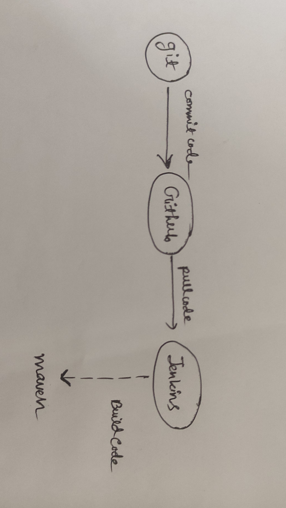
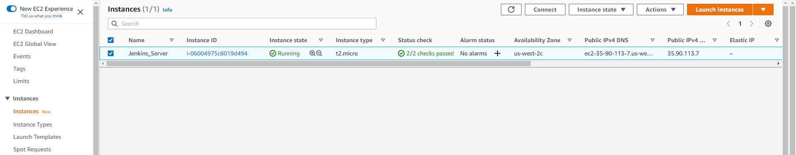
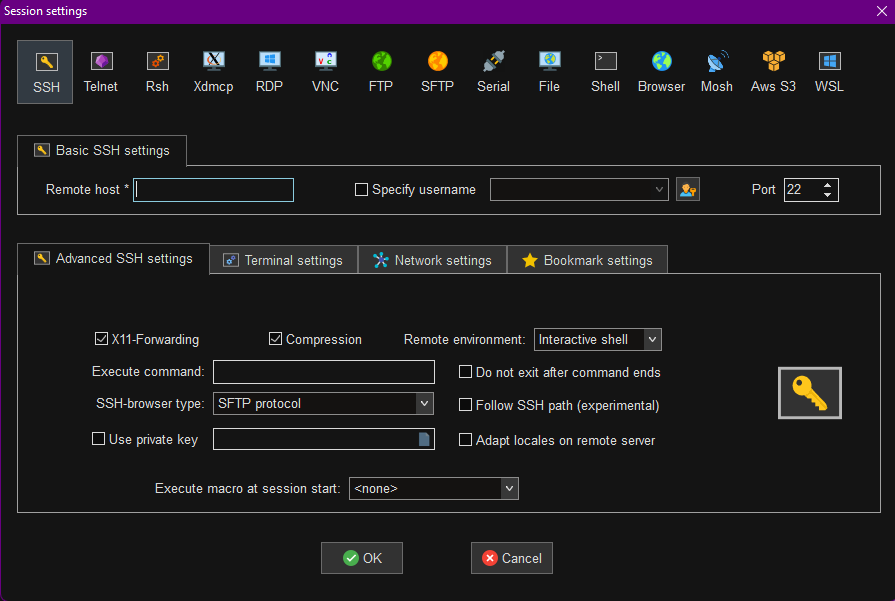
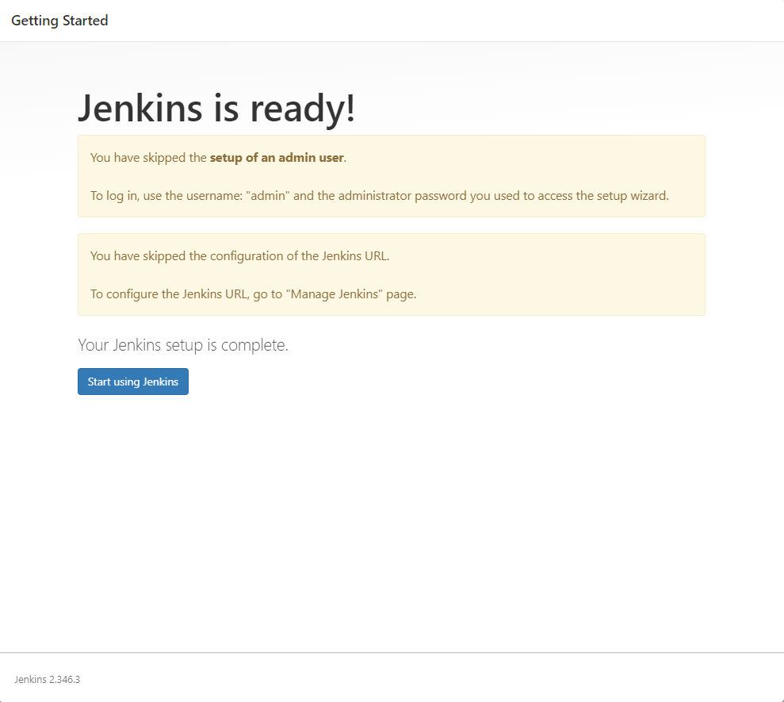
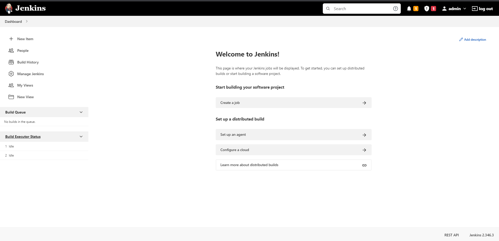
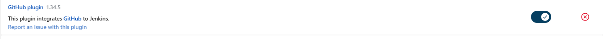
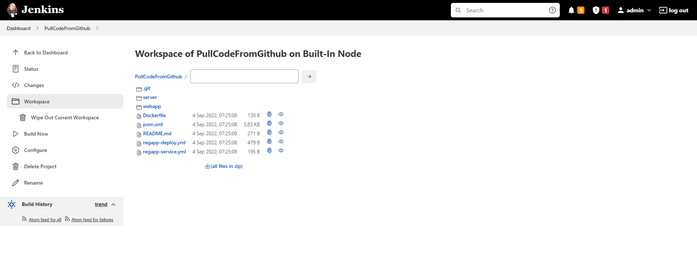
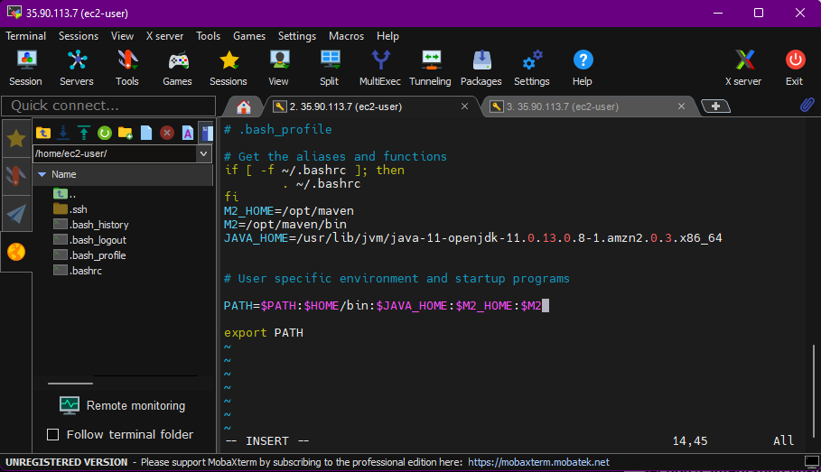
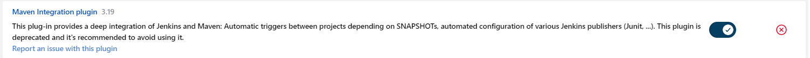
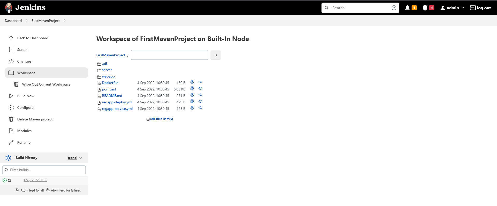

## Project Goal:

To implement a CI/CD pipeline using Jenkins, Maven and Git.

## Source Code:

Source code taken from https://github.com/yankils/hello-world.

## Setting the Jenkins Server:

* First an ec2 instance in the AWS has been created.

* MobaXterm has been used for creating remote sessions.
* Added the keypair that was generated for the instance to the private key option in the advanced 
  ssh settings.

* Got the centos/redhat LTS version of Jenkins. Link: https://pkg.jenkins.io/redhat-stable/  
* Installed the epel releases using amazon-linux-extras instead of sudo.(Amazon linux was selected in the ec2 instance)
  : 'amazon-linux-extras install epel'
* Installed java-openJDK11 ( 'amazon-linux-extras install java-openJDK11' )
* Installed jenkins 'yum install jenkins'
* Start the jenkins server: 'service jenkins start'
* To access the UI version of Jenkins, grabbed the public IPv4 adress of the instance and 
  routed it to port 8080.

## Integrating Git with Jenkins

* Installed git: 'yum install git'
* Installed Github plugin from the pluggin manager in the Jenkins UI.(from the available section).

## Running Jenkins job to pull code from Github

## Integrating Maven with Jenkins
* Installed Maven using wget command. Link:https://maven.apache.org/download.cgi
* Setting up environmental variables:

* Installed Maven pluggin:

## Building the project with Jenkins

